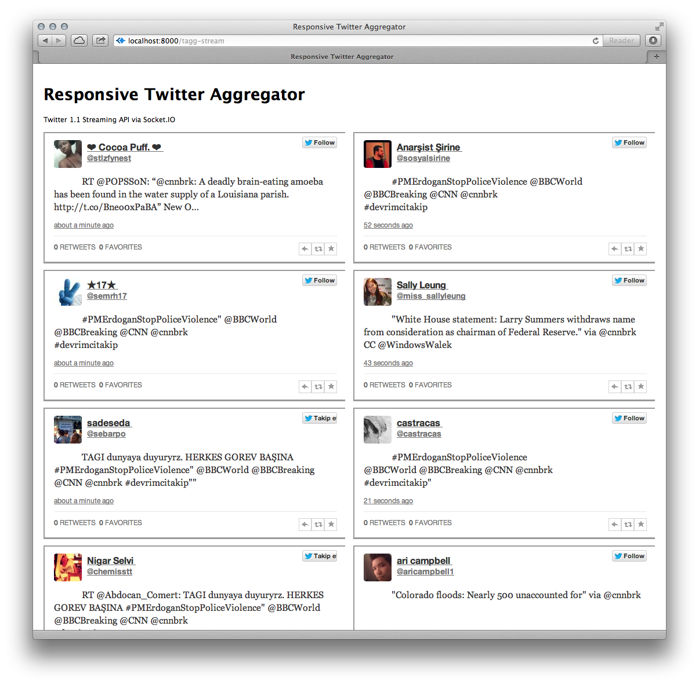

Responsive Twitter Aggregator
=============================

This Express/Node app generates a Twitter stream using "repsonsive"
techniques. A stream is requested via Twitter 1.1 API and OAuth 1.0,
piped with Node's Stream API and transmitted from server to client via
Node's Socket.io library.

Client Access
-------------

Once the app is running on a server, say, *tagg.host.com*, it is accessed
from a client at the URI: *tagg.host.com:8000/tagg-stream*.
The most recent tweets are streamed across as many columns as
supported by the client device per CSS3 media queries. 

Server Installation
-------------------

Assuming *node* and its package manager, *npm*, are installed, fetch
the *tagg* source via the command line:

    git clone http://github.com/slewsys/tagg.git

Install *tagg* dependencies:

    cd tagg; npm install -g

Create a key file, *private/twitter-key.json*, by replacing
the keys/secrets in template *private/twitter-key.json.ex* with those
provided by Twitter.com for your app (see:
[Twitter App Manager](https://dev.twitter.com/apps)):

    {
        "consumerKey": "pFIQnX9UfxHRYrsWD8HhzU",
        "consumerSecret": "Mu0oXHMLUyLtA9ACLyReR63tWgsVmhvZXohMulvDfk",
        "accessTokenKey": "158728877-7h9ubC6Q1jX9j02qjCReU1Ca2cb17d8to8fyZa9D",
        "accessTokenSecret": "0mfu6pNJ3QEqnj3Tf11qbnACJY3U9uXPdfXPYEgjFT"
    }

Finally, update the paths in the included script, *start-server*,
appropriate to your system and run it:

    ./start-server
